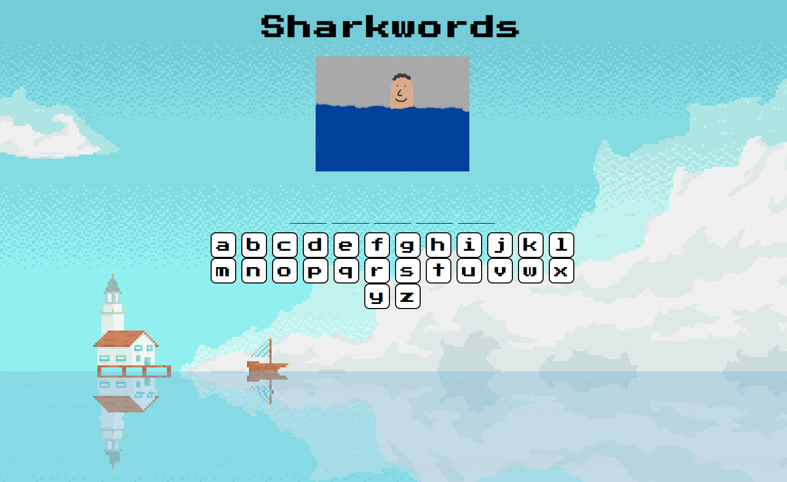
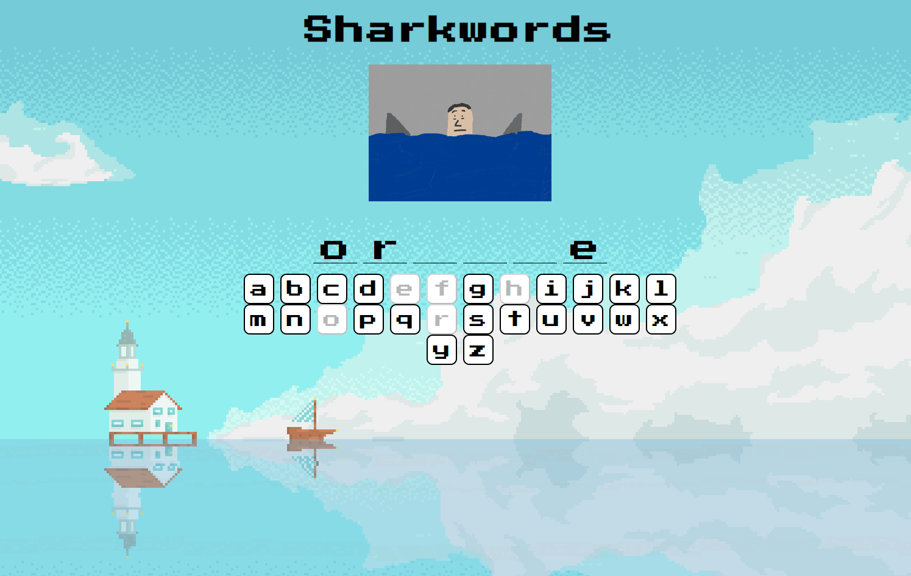
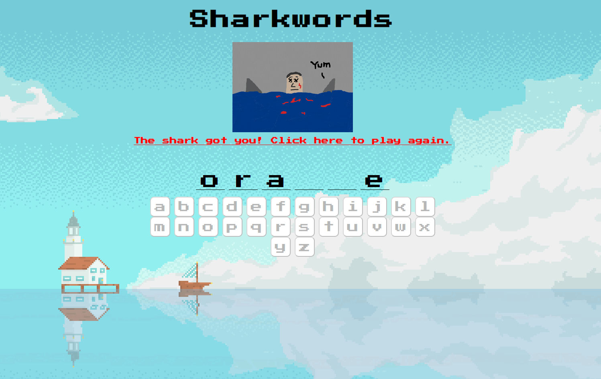

# Sharkwords
Fun word guessing game - guess the word before the sharks attack!

## Technologies Used
Python, Flask, Javascript, HTML, CSS

## Demo





## 📖 Set Up
To run this project, first clone or fork this repo:
```
git clone https://github.com/kat-jiang/Shark-words-game.git
```
Create and activate a virtual environment inside your directory
```
virtualenv env
source env/bin/activate
```
Install the dependencies:
```
pip install -r requirements.txt
```
Run the app:
```
python3 server.py
```
You can now navigate to 'localhost:5000/' to access the game!

